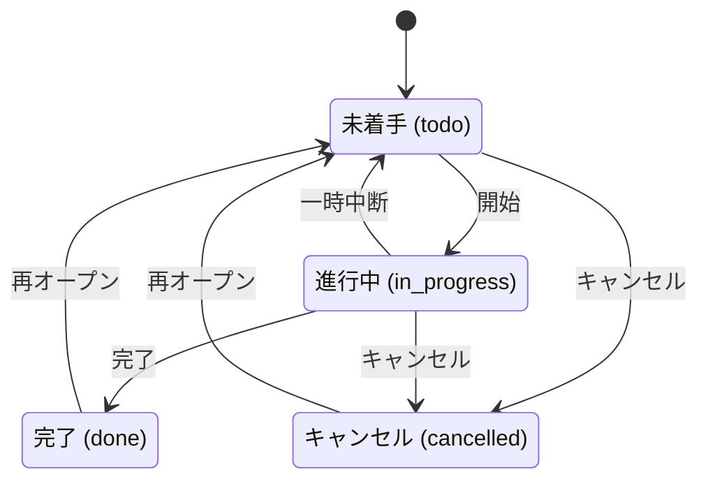

# 要件定義書：タスク管理アプリケーション

## 1. システム概要

### 目的

チームおよび個人が日々のタスクを一元管理し、進捗状況を把握できるWebアプリケーション。

### 対象ユーザー

- 個人・チームのタスク管理を行うすべてのユーザー

### システム構成

| 項目 | 内容 |
|------|------|
| アクセス方法 | Webブラウザ |
| バックエンド | Python (FastAPI) |
| データベース | SQLite |
| URL | `http://localhost:8000` |

---

## 2. 機能要件

### 2.1 タスク管理

#### T-01 タスク作成
タイトル・説明・優先度・期日・カテゴリを指定してタスクを作成する。

**入力項目：**
- タイトル（必須）
- 説明（任意）
- 優先度（必須、デフォルト: 中）
- 期日（任意）
- カテゴリ（任意）

#### T-02 タスク一覧表示
全タスクをフィルタ付きで一覧表示する。

**表示項目：**
- タイトル
- カテゴリ名（未設定の場合は空欄）
- 優先度（低・中・高）
- ステータス（未着手・進行中・完了・キャンセル）
- 期日（未設定の場合は「未設定」、期限切れの場合は赤色表示）
- 操作ボタン（詳細・編集・削除）

#### T-03 タスク詳細表示
1件のタスクの全情報を表示する。

**表示項目：**
- タイトル
- 説明（未設定の場合は空欄）
- ステータス
- 優先度
- 期日（未設定の場合は空欄）
- カテゴリ名（未設定の場合は空欄）
- 作成日時
- 更新日時
- ステータス遷移ボタン（現在のステータスから遷移可能なステータスのみ表示）
- 編集・削除ボタン

#### T-04 タスク編集
タスクのタイトル・説明・優先度・期日・カテゴリを更新する。ステータスはステータス遷移ボタンから変更する。

#### T-05 ステータス遷移
タスク詳細画面から、所定の遷移ルール（3.2節参照）に従いステータスを変更する。

#### T-06 タスク削除
タスクを削除する。削除後はタスク一覧画面へリダイレクトする。

#### T-07 タスクフィルタ
タスク一覧画面で以下の条件でタスクを絞り込む。複数条件はAND条件で適用される。

**フィルター条件：**
- **ステータス**: 未着手（`todo`）・進行中（`in_progress`）・完了（`done`）・キャンセル（`cancelled`）から選択
- **カテゴリ**: 登録済みカテゴリから選択
- **キーワード**: タイトルまたは説明に含まれる文字列で部分一致検索

#### T-08 期限切れタスク表示
期日が本日より前かつ未完了（未着手または進行中）のタスクの期日を赤色でハイライト表示する。

---

### 2.2 カテゴリ管理

#### C-01 カテゴリ作成
名前とカラーコード（`#RRGGBB` 形式）を指定してカテゴリを作成する。

#### C-02 カテゴリ一覧表示
全カテゴリを一覧表示する。

**表示項目：**
- カテゴリ名
- カラー（指定カラーコードのバッジで表示）
- 編集ボタン
- 削除ボタン

#### C-03 カテゴリ編集
カテゴリ名・カラーコードを更新する。

#### C-04 カテゴリ削除
カテゴリを削除する（進行中タスクが紐付いている場合は削除不可、詳細は3.5節参照）。

---

### 2.3 ダッシュボード

#### D-01 ステータス別件数表示
各ステータスのタスク件数をカード形式で表示する。

**表示項目：**
- 未着手タスク件数
- 進行中タスク件数
- 完了タスク件数
- キャンセルタスク件数

#### D-02 期限切れ件数表示
期日が本日より前かつ未完了（未着手または進行中）のタスク件数を表示する。

---

## 3. ビジネスルール

### 3.1 タスクステータス

タスクは以下の4つのステータスを持つ：

| ステータス値 | 表示名 | 説明 |
|------------|--------|------|
| `todo` | 未着手 | 作成直後のデフォルト状態 |
| `in_progress` | 進行中 | 作業中 |
| `done` | 完了 | 作業完了 |
| `cancelled` | キャンセル | 作業中止 |

### 3.2 ステータス遷移ルール

**許可される遷移：**

| 現在のステータス | 遷移先ステータス | 操作の意味 |
|--------------|--------------|----------|
| 未着手 (todo) | 進行中 (in_progress) | 作業開始 |
| 未着手 (todo) | キャンセル (cancelled) | キャンセル |
| 進行中 (in_progress) | 完了 (done) | 完了 |
| 進行中 (in_progress) | 未着手 (todo) | 一時中断・未着手に戻す |
| 進行中 (in_progress) | キャンセル (cancelled) | キャンセル |
| 完了 (done) | 未着手 (todo) | 再オープン |
| キャンセル (cancelled) | 未着手 (todo) | 再オープン |

**禁止される遷移（エラー）：**

| 現在のステータス | 遷移先ステータス | 理由 |
|--------------|--------------|------|
| 完了 (done) | 進行中 (in_progress) | 未着手を経由する必要がある |
| 完了 (done) | キャンセル (cancelled) | 完了済みはキャンセル不可 |
| キャンセル (cancelled) | 進行中 (in_progress) | 未着手を経由する必要がある |
| キャンセル (cancelled) | 完了 (done) | キャンセル済みは完了不可 |
| 任意 | 同じステータス | 変化なし遷移は不正 |

**遷移図：**

### 3.3 タスク優先度

| 優先度値 | 表示名 |
|---------|--------|
| `low` | 低 |
| `medium` | 中 （デフォルト）|
| `high` | 高 |

### 3.4 期日バリデーションルール

| # | ルール | エラー |
|---|--------|--------|
| D-1 | タスク作成時、期日に過去の日付は設定不可（基準：リクエスト受付時点の日付） | 「期日に過去の日付は設定できません」 |
| D-2 | タスク更新時、期日に過去の日付は設定不可（基準：リクエスト受付時点の日付） | 「期日に過去の日付は設定できません」 |
| D-3 | 期日の設定は任意（未設定可） | - |
| D-4 | ステータス遷移時は期日の過去チェックを行わない | - |

### 3.5 カテゴリルール

| # | ルール | エラー |
|---|--------|--------|
| K-1 | カテゴリ名は一意（重複不可） | 「カテゴリ名「{name}」はすでに使用されています」 |
| K-2 | カラーコードは `#RRGGBB` 形式のみ許可 | 「カラーコードは #RRGGBB 形式で入力してください」 |
| K-3 | 進行中タスクを持つカテゴリは削除不可 | 「進行中のタスクが {n} 件あるため、カテゴリを削除できません」 |
| K-4 | 削除可能なカテゴリを削除した場合、関連タスクのカテゴリは「なし」になる | - |

---

## 4. 画面一覧

### 4.1 ダッシュボード

- **URL**: `/`
- **表示内容**:
  - ステータス別タスク件数（未着手・進行中・完了・キャンセル）
  - 期限切れタスク件数

### 4.2 タスク一覧

- **URL**: `/tasks`
- **クエリパラメータ**: `?status=&category_id=&search=`
- **表示内容**:
  - タスク一覧テーブル（タイトル・カテゴリ・優先度・ステータス・期日・操作）
  - フィルタフォーム（ステータス・カテゴリ・フリーワード）
  - 期限切れタスクは期日を赤色で表示

### 4.3 タスク詳細

- **URL**: `/tasks/{id}`
- **表示内容**:
  - タスクの全フィールド
  - 現在のステータスから遷移可能なステータスへのボタン（遷移不可なステータスのボタンは表示しない）
  - 編集・削除ボタン

### 4.4 タスク作成

- **URL**: `/tasks/new` (GET: フォーム表示), `/tasks` (POST: 作成)
- **入力フィールド**:
  - タイトル（必須）
  - 説明（任意）
  - 優先度（必須、デフォルト: 中）
  - 期日（任意）
  - カテゴリ（任意）

### 4.5 タスク編集

- **URL**: `/tasks/{id}/edit` (GET: フォーム表示), `/tasks/{id}` (POST: 更新)
- **入力フィールド**: タスク作成と同じ（ステータスはステータス遷移ボタンから変更）

### 4.6 カテゴリ一覧

- **URL**: `/categories`
- **表示内容**:
  - カテゴリ一覧テーブル（名前・カラー・編集・削除ボタン）

### 4.7 カテゴリ作成

- **URL**: `/categories/new` (GET), `/categories` (POST)
- **入力フィールド**:
  - カテゴリ名（必須）
  - カラーコード（必須、デフォルト: #6c757d）

### 4.8 カテゴリ編集

- **URL**: `/categories/{id}/edit` (GET), `/categories/{id}` (POST)
- **入力フィールド**: カテゴリ作成と同じ

---

## 5. エラーケース

### 5.1 タスク操作エラー

| 操作 | エラー条件 | エラーメッセージ |
|------|-----------|----------------|
| 作成 | タイトルが空 | フォームのHTML必須バリデーション |
| 作成/更新 | 期日が過去の日付 | 「期日に過去の日付は設定できません」 |
| 作成/更新 | 存在しないカテゴリID | 「カテゴリ ID={n} が見つかりません」 |
| ステータス遷移 | 禁止された遷移 | 「「{現在}」から「{遷移先}」への遷移は許可されていません」 |
| ステータス遷移 | 同じステータスへの遷移 | 「タスクはすでに「{status}」状態です」 |
| 詳細/編集/削除 | 存在しないタスクID | 404 Not Found |

### 5.2 カテゴリ操作エラー

| 操作 | エラー条件 | エラーメッセージ |
|------|-----------|----------------|
| 作成/更新 | 重複するカテゴリ名 | 「カテゴリ名「{name}」はすでに使用されています」 |
| 作成/更新 | カラーコードが不正形式 | 「カラーコードは #RRGGBB 形式で入力してください」 |
| 削除 | 進行中タスクが存在する | 「進行中のタスクが {n} 件あるため、カテゴリを削除できません」 |

---

## 6. データモデル

### 6.1 Taskテーブル

| カラム名 | 型 | 制約 | 説明 |
|---------|-----|------|------|
| id | INTEGER | PK, AUTO | タスクID |
| title | VARCHAR(200) | NOT NULL | タイトル |
| description | TEXT | NULL許容 | 説明 |
| status | VARCHAR | NOT NULL, default=`todo` | ステータス（`todo`/`in_progress`/`done`/`cancelled`） |
| priority | VARCHAR | NOT NULL, default=`medium` | 優先度（`low`/`medium`/`high`） |
| due_date | DATE | NULL許容 | 期日 |
| category_id | INTEGER | FK→categories.id, NULL許容 | カテゴリID |
| created_at | DATETIME | NOT NULL | 作成日時 |
| updated_at | DATETIME | NOT NULL | 更新日時 |

### 6.2 Categoryテーブル

| カラム名 | 型 | 制約 | 説明 |
|---------|-----|------|------|
| id | INTEGER | PK, AUTO | カテゴリID |
| name | VARCHAR(100) | NOT NULL, UNIQUE | カテゴリ名 |
| color | VARCHAR(7) | NOT NULL, default=`#6c757d` | カラーコード（#RRGGBB形式） |
| created_at | DATETIME | NOT NULL | 作成日時 |

### 6.3 リレーション

- `tasks.category_id` → `categories.id`
- カテゴリを削除した場合、関連タスクの `category_id` は `NULL` になる（SET NULL）

---

## 7. 非機能要件

| 項目 | 内容 |
|------|------|
| テスト容易性 | サービス層にビジネスロジックを集約し、Unit testで独立してテストできること |
| テスト容易性 | リポジトリをDI（依存性注入）で差し替え可能にし、モックテストが可能なこと |
| テスト容易性 | e2eテスト用にHTMLの重要要素に `data-testid` 属性を付与すること |
| 開発環境 | `uvicorn app.main:app --reload --port 8000` で起動できること |
| テスト実行 | `pytest -m unit` でUnit testのみ、`pytest -m e2e` でe2eテストのみ実行できること |
